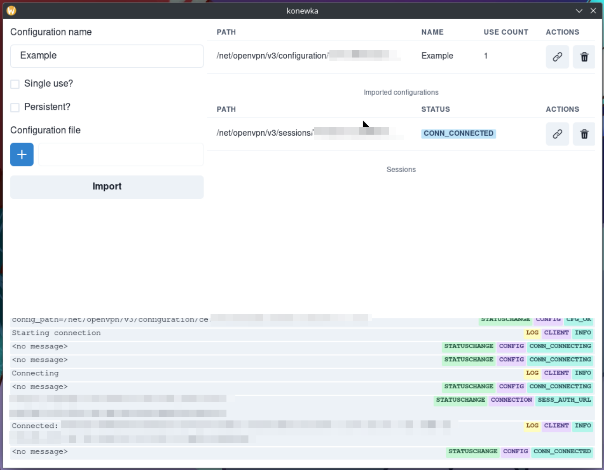

# konewka
konewka is a user-friendly GUI application crafted in Rust utilizing the Tauri framework. Designed specifically for Linux systems, Konewka serves as a convenient graphical wrapper over OpenVPN3, empowering users to effortlessly manage their VPN configurations and sessions with ease.

It communicates with [openvpn3-linux](https://github.com/OpenVPN/openvpn3-linux) via dbus.

## Features
* Importing .ovpn configuration files
* Removing imported configurations
* Starting tunnels (sessions)
  * Only web auth is supported, auth with credentials yet to come
* Connecting and disconnecting sessions
* Notifications (connected, disconnected)

# Contributions
Contributions to Konewka are highly encouraged and welcomed! Whether you spot a bug, have an enhancement in mind, or want to contribute code, feel free to open an issue or submit a pull request.

# License
Konewka is licensed under the MIT License. See the LICENSE file for more details.